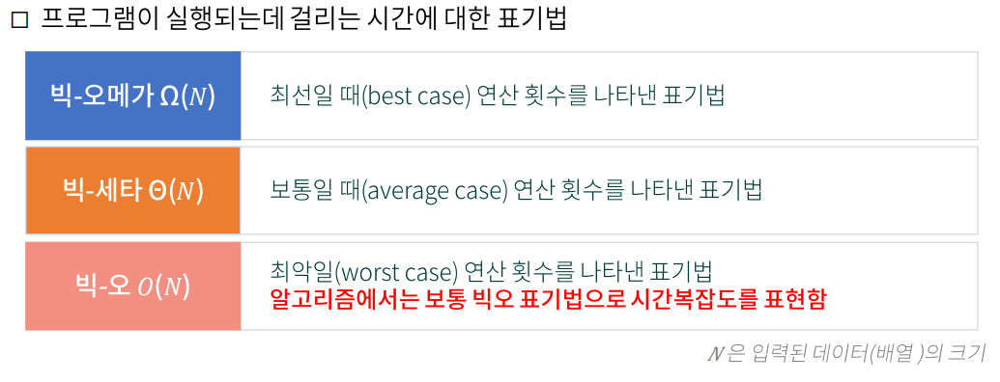
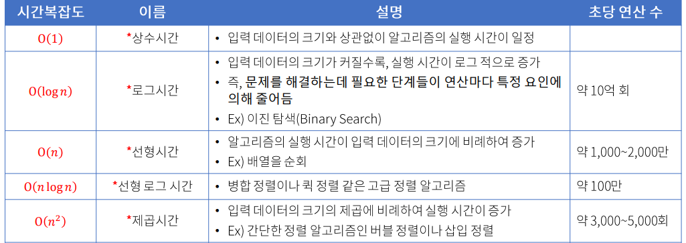

# <span style="color:#616161; font-weight:bold;">코딩테스트</span>

<br />

## <span style="color:#ffa59c; font-weight:bold;">코딩테스트 입문</span>
-프로그래머스 3단계 까지 할 수 있으면 코딩테스트 할 만 하다

-코딩테스트의 클래스이름은 무조건 Solution 으로 정해야한다. 그렇지 않으면 답지로 인식을 하지 않는다.   

## <span style="color:#ffa59c; font-weight:bold;">복잡도</span>

### 시간복잡도
-얼마나 빠른 시간안에 실행되는가.   

-가장 큰 값(시간이 오래걸리는)이 시간복잡도가 된다.   




-상수시간 : 특별한 반복 처리 없음 => O(1)
```java
public static int solution(int n) {
    return n * (n + 1) / 2;
}
```
<br />
-선형시간 : 배열의 반복문   => O(n)

```java
public static int solution(int n) {
   int total = 0;

   for (int i = 1; i <= n; i++) {
   total += i;
   }
  
   return total;
   }
```
<br />

-로그시간 : 증감식이 * or / 라서 반복할 수록 반복 횟수가 줄어드는 경우 => O(log n)

```java
public static int solution(int n) {
   int cnt = 0; // 2로 나눈 횟수를 저장할 변수
   while (n > 0) { // n이 0보다 큰 동안 반복(n이 0이 되면 종료)
   n /= 2; // n을 2로 나눈 몫을 n에 저장
   cnt++; // 2로 나눈 횟수를 1 증가
   }
   return cnt; // 2로 나눈 횟수 반환
 }
```
<br />

-선형 로그 시간 : 상수시간을 로그시간만큼 반복하는 경우 => O(n log n)

-제곱 시간 : 이중 반복문같은 경우 => O(n^2)

-시간복잡도 계산은 정확한 수치의 값을 도출하는게 아니라 근사값의 공식(시간, 선형.. 등)을 구하는 것이다.   

-시간복잡도 계산은 위에서 부터 한 줄 한 줄 하는데 중첩되어 있느냐, 아니냐에 따라 달라진다. 반복문안의 반복문은 중첩이되어 제곱시간이 되고 반복문 바깥에 반복문 같은 형식의 병렬구조라면 가장 큰 시간복잡도인 선형시간이 된다.   

-코딩테스트의 문제를 풀 때는 시간복잡도를 계산하여 어떤 공식을 사용해야하는 유형인지를 파악하는게 1순위다.   

### 공간복잡도
-얼마나 작은 메모리를 사용하는가.