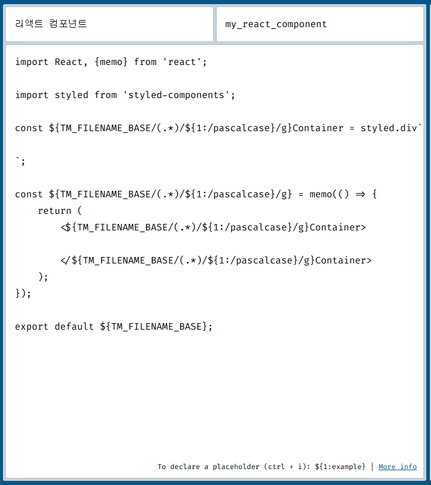

# <span style="color:#616161; font-weight:bold;">유용한 사이트 모음 </span>

## <span style="color:#ffa59c; font-weight:bold;">font, icon, img</span>
-google fonts   
-fontAwesome   
- chrome web store의image  downloader - imageye (화면의 이미지 전체 다운로드)   

## <span style="color:#ffa59c; font-weight:bold;">color</span>
-color picker   

## <span style="color:#ffa59c; font-weight:bold;">reperence</span>
-GDWeb  
-pinterest  
-rwdb.kr  

## <span style="color:#ffa59c; font-weight:bold;">HTML, CSS, javascript</span>
-MDN   
-w3school   

## <span style="color:#ffa59c; font-weight:bold;">ppt</span>
-https://www.canva.com/   

## <span style="color:#ffa59c; font-weight:bold;">반복되는 기초 공사 코드 자동생성</span>

-https://snippet-generator.app/   

#### react components js 파일 

-`${TM_FILENAME_BASE/(.*)/${1:/pascalcase}/g} : 파일이름이 들어가고 스네이크 표기를 카멜표기로 바꾸어줌`   

-설정 -> 코드조각 (snipet) 에서 javascript.json 에 이미지엔 없지만 우측에 만들어진 코드를 입력   

-우측 상단 my_react_component가 자동완성 키워드가 됨   



```json
import React, {memo} from 'react';

import styled from 'styled-components';

const ${TM_FILENAME_BASE/(.*)/${1:/pascalcase}/g}Container = styled.div`

`;

const ${TM_FILENAME_BASE/(.*)/${1:/pascalcase}/g} = memo(() => {
    return (
        <${TM_FILENAME_BASE/(.*)/${1:/pascalcase}/g}Container>

        </${TM_FILENAME_BASE/(.*)/${1:/pascalcase}/g}Container>
    );
});

export default ${TM_FILENAME_BASE};

```

-`${TM_DIRECTORY/^.+\\(.*)/${1:/pascalcase}/g} 로 바꾸어 주면 파일이름 대신 폴더이름이 들어간다. 주로 index.js는 폴더마다 들어가서 이걸로 사용`   

#### index.js 전용 스니펫

-index.js파일을 스니펫으로 사용할 때 변수명을 폴더이름으로 설정한다.   

-아래 코드는 Window, Mac 모두 호환되도록 만든 코드이다.

```json

    "리액트 컴포넌트(index)": {
        "prefix": "my_react_component_index",
        "body": [
            "import React, {memo} from 'react';",
            "",
            "import styled from 'styled-components';",
            "",
            "const ${TM_DIRECTORY/^.+[\\/\\\\](.*)$/${1:/pascalcase}/}Container = styled.div`",
            "",
            "`;",
            "",
            "const ${TM_DIRECTORY/^.+[\\/\\\\](.*)$/${1:/pascalcase}/} = memo(() => {",
            "    return (",
            "        <${TM_DIRECTORY/^.+[\\/\\\\](.*)$/${1:/pascalcase}/}Container>",
            "            <h2>${TM_DIRECTORY/^.+[\\/\\\\](.*)$/${1:/pascalcase}/}</h2>",
            "",
            "        </${TM_DIRECTORY/^.+[\\/\\\\](.*)$/${1:/pascalcase}/}Container>",
            "    );",
            "});",
            "",
            "export default ${TM_DIRECTORY/^.+[\\/\\\\](.*)$/${1:/pascalcase}/};"
        ],
        "description": "리액트 컴포넌트(index)"
    }

```